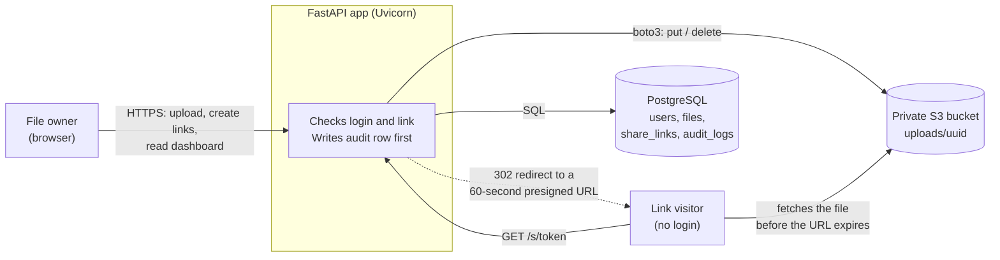

# SecureShare

SecureShare is a web app for sharing private files safely. You upload a file, make a link for it, and send the link to someone. The link stops working after the time you choose, and you can see every time someone opens it.

## How it works

1. You sign up and log in.
2. You upload a file. It is stored in a private AWS S3 bucket, so nobody can open it directly.
3. You create a share link and choose:
   - how long it lasts: 10 minutes, 1 hour, 1 day or 7 days
   - what the person can do: **view** the file in the browser, or **download** it
4. You send the link. The person does not need an account.
5. When they open the link, the app checks that it is still valid, saves a record of the visit, and only then lets them see the file.
6. You can cancel a link at any time, and a dashboard shows who opened what and when.

## Features

| ID | Feature | What it does |
| --- | --- | --- |
| F1 | Accounts | Sign up, log in, log out. Session is a JWT in an HttpOnly cookie. |
| F2 | Files | Upload (max 10 MB, allow-listed types), list your files, delete a file. |
| F3 | Share links | Expire after 10 min, 1 hour, 1 day or 7 days. Revoke early. |
| F4 | Permissions | `view` opens in the browser, `download` saves the file. |
| F5 | Audit trail | Every upload, link, view, download, revoke and blocked attempt is logged and shown on a live dashboard. |

## Architecture



The app is the only gatekeeper: the bucket is private, and S3 hands out file bytes only through a presigned URL that the app creates **after** the checks pass and the audit row is saved.

## Tech stack

| Layer | Choice |
| --- | --- |
| Language | Python 3.12 |
| Web framework | FastAPI served by Uvicorn |
| Database | PostgreSQL 16 (Docker locally, AWS RDS later) |
| ORM | SQLAlchemy 2 with `psycopg` 3 |
| Config | `pydantic-settings` reading `.env` |
| Passwords | Argon2 (`argon2-cffi`) |
| Sessions | JWT (`PyJWT`) in an HttpOnly cookie |
| Files | AWS S3 via `boto3`, uploads read with `python-multipart` |
| Tests | `pytest`, `httpx` |
| Frontend | Plain HTML, CSS and JavaScript (no framework, no build step) |

## Run it locally (Windows)

You need Python 3.12, Docker Desktop and an AWS S3 bucket in `ap-southeast-2` with credentials for it.

```powershell
# 1. Start PostgreSQL in Docker
docker compose up -d

# 2. Create the virtual environment and install the libraries
py -3.12 -m venv venv
.\venv\Scripts\activate
pip install -r requirements.txt

# 3. Create your .env from the template and fill in the blanks
copy .env.example .env
#    DATABASE_URL, AWS_ACCESS_KEY_ID, AWS_SECRET_ACCESS_KEY,
#    AWS_REGION=ap-southeast-2, S3_BUCKET_NAME, JWT_SECRET (a long random string)

# 4. Run the app
uvicorn app.main:app --reload
```

Open <http://localhost:8000> and sign up for a new account.

Other URLs: API docs at <http://localhost:8000/docs>, health check at <http://localhost:8000/healthz>.

### Run the tests

```powershell
pytest
```

The tests use a separate database called `secureshare_test` (created automatically in the same Docker Postgres) and a **mocked S3**, so they never touch your real data or AWS.

## Project layout

```
app/            FastAPI code (one job per file, see EXPLAINED.md)
  routers/      auth, files, links, share (public), audit
static/         HTML pages, one CSS design system, small JS files
tests/          pytest tests
scripts/        helper scripts
docs/           blueprint.md (design background)
```

## Security decisions

- **Private bucket.** Files are reachable only through a presigned URL the app creates after checking the link.
- **60-second presigned URLs.** The long-lived credential is the share link, which the app checks every time and can revoke.
- **Random tokens.** Share tokens come from `secrets.token_urlsafe(32)` (256 random bits).
- **Random S3 keys.** Files are stored as `uploads/<uuid4>`, so a file name never leaks.
- **Argon2 password hashes.** Passwords are never stored or logged.
- **HttpOnly session cookie.** `HttpOnly`, `SameSite=Lax`, and `Secure` in production; JavaScript cannot read it.
- **Ownership checks return 404.** Another user's file looks the same as a file that does not exist.
- **Audit before serve.** The audit row is saved before the redirect to S3, so no access can skip the log. The log is append-only: the app only inserts.
- **Upload limits.** 10 MB enforced while reading, an extension allow-list, empty files refused, content type chosen by the server.
- **Security headers and login rate limit.** `nosniff`, `X-Frame-Options: DENY`, `Referrer-Policy: no-referrer`; 10 failed logins per IP per 5 minutes.
- **No secrets in code.** Everything comes from `.env`, which is git-ignored. Only `.env.example` is committed.

Honest limits are listed in [EXPLAINED.md](EXPLAINED.md).
